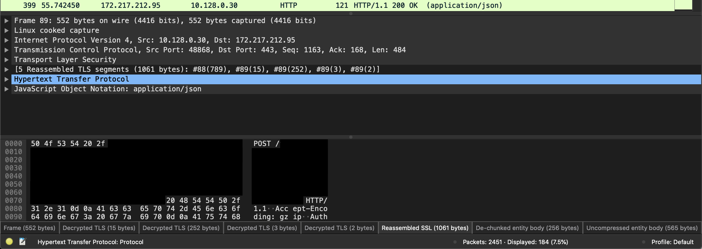

# sklton-key

`sklton-key`, pronounced 'skeleton key', allows you to decrypt TLS traffic of a
target go process. `sklton-key` attaches to go processes and intercepts the
KeyLogWriter method to enable SSLKEYLOGFILE-style logging of TLS secrets.

## Requirements

* binary must contain DWARF debugging information
* binary must be compiled with at least go1.8

## Installation

```
go install github.com/amlweems/sklton-key
```

## Usage

```
$ sklton-key -h
Usage of sklton-key:
  -pid int
    	Pid to attach to.
  -cmd string
    	Command to launch and attach to.
  -log string
    	Log file to write key log to (default "skl.log")
  -tcpdump
    	If true, capture packets and save pcap to a file
  -dev string
    	Device to capture packets on (default "eth0")
  -pcap string
    	Path to write pcap to (default "skl.pcap")
```

You may now start your target process and launch `sklton-key` to begin writing
the key log:
```
$ sklton-key -cmd ./target-binary -tcpdump -dev en0
```

Once the binary begins making requests, you can use Wireshark to decrypt the
packet capture. Wireshark 1.6.0 and above can use these log files to decrypt
packets. Set the following Wireshark setting to your `skl.log` file.

Edit→Preferences→Protocols→TLS→(Pre)-Master-Secret log filename


